# cors project
### BI

DNS : freenom

url : <https://corsmarket.shop>

## 0. 목차
[1. 프로젝트 요약](#1-프로젝트-요약)

[2. 프로젝트 타겟](#2-프로젝트-타겟)

[3. 메인 기능](#3-메인-기능)

[4. 프론트엔드](#4-프론트엔드)

[5. 백엔드](#5-백엔드)

[6. 배포](#6-배포)

[7. 사용 툴](#7-사용-툴)

[8. 프로젝트원](#8-프로젝트원)

## 1. 프로젝트 요약
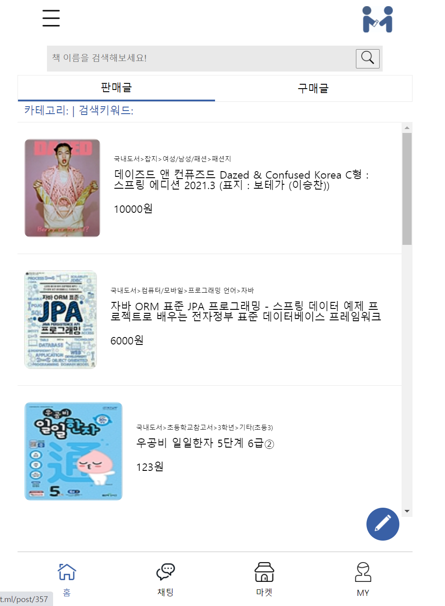 
코스마켓 프로젝트는 5명의 팀원이 약 40여일 간 개발한 토이프로젝트 입니다. 
충분한 협의를 통해 주제선정,요구사항 분석, 기술스택, ERD설계 등 모든 것을 함께 진행하였습니다. 
주제는 중고책거래 웹 어플리케이션이며, 웹 브라우저 및 모바일 브라우저에서도 정상적으로 작동되게 설계하였습니다 
기간이 짧아 미완성된 기능들이 있지만, 앞으로 보완해나갈 예정입니다.

## 2. 프로젝트 타겟
책을 사랑하는 모든 사용자들이 타겟입니다. 
십대,이십대,삼십대 등 나이대와 상관없이, 대학생,직장인 직업과도 상관없이  
책을 사랑하고, 지식을 사랑하는 모든 사용자들을 타겟층으로 삼았습니다.

## 3. 메인 기능

--- 
### 3.1 인증
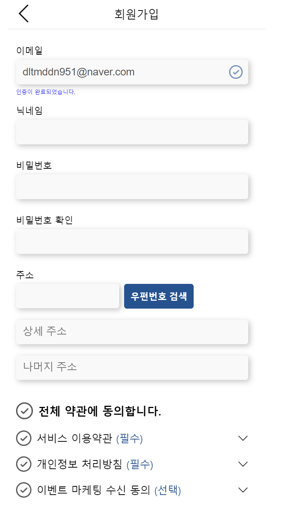 
일반 회원가입뿐만 아니라 소셜로그인 기능도 추가하였습니다. 
spring security와 jwt를 사용하여 보안을 고려하여 개발하였습니다. 
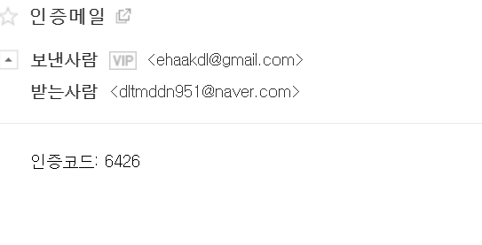 
이메일을 이용한 이메일 인증기능도 구현하였습니다.

### 3.2 CRUD
**3.2.1 CRUD**

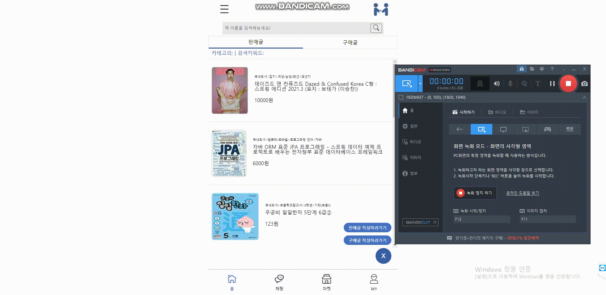 
알라딘 api 서버를 nginx를 통해 같은 도메인 내 upstream 등록으로 접근하게해 cors 에러 방지 하였습니다. 
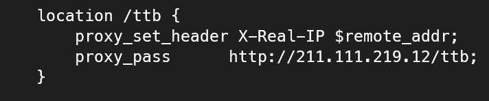 
AWS S3 버켓을 사용하여 파일 업로드를 구현하였습니다.  
multipart 파일을 java file로 변환하여 서버에 업로드 후 
S3 라이브러리를 이용하여 업로드를 하고, 업로드 후 WAS에 업로드 된 파일을 삭제합니다.

**3.2.3 search & filtering**

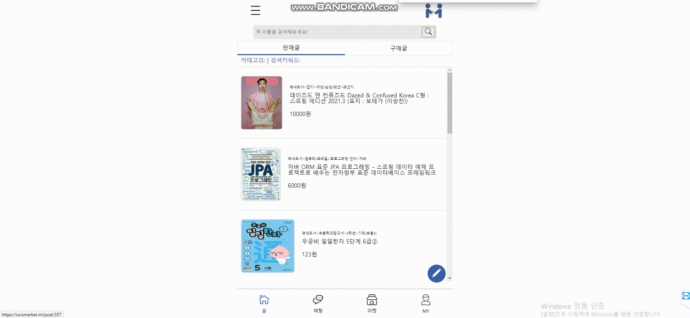 
querydsl을 이용한 동적쿼리를 구성하여 검색 및 필터링 적용을 하였습니다. 
제목 검색 및 카테고리 정렬, 인피니트 스크롤링을 위한 쿼리 구성으로, 페이지네이션 없이  
스크롤링만으로 페이지 기능을 구현하였습니다.

**3.2.4 mypage**

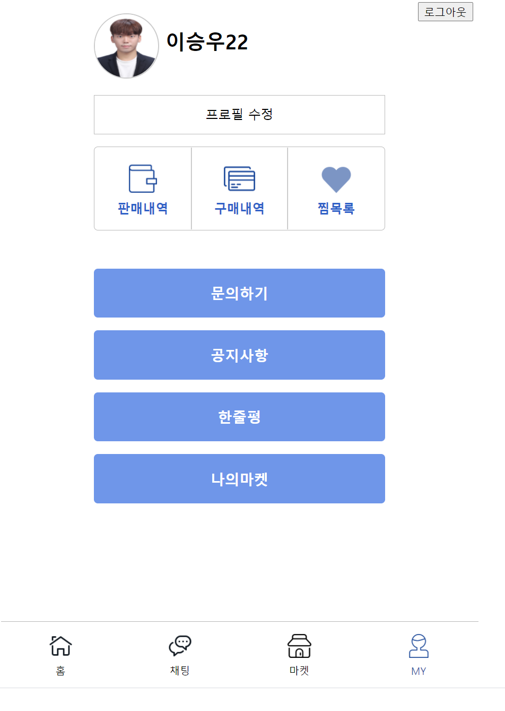 

**3.2.5 찜**

 

**3.2.6 판매내역**

 

**3.2.7 구매내역**

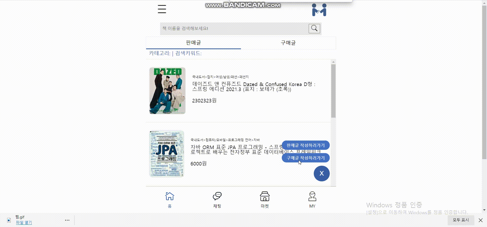 

**3.2.7 공지사항목록**

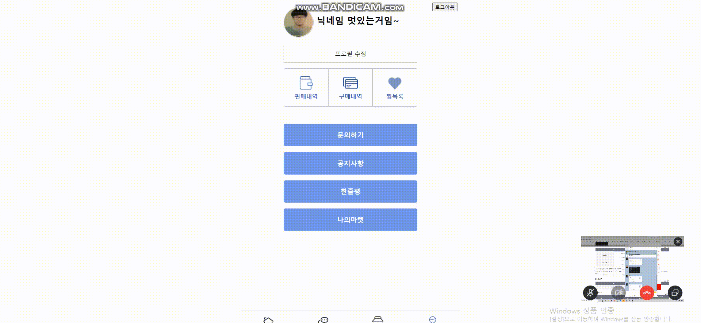 

**3.2.7 소셜로그인**

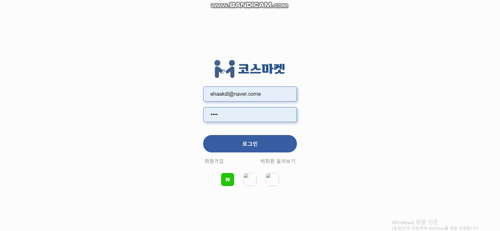 

**3.2.7 프로필편집**

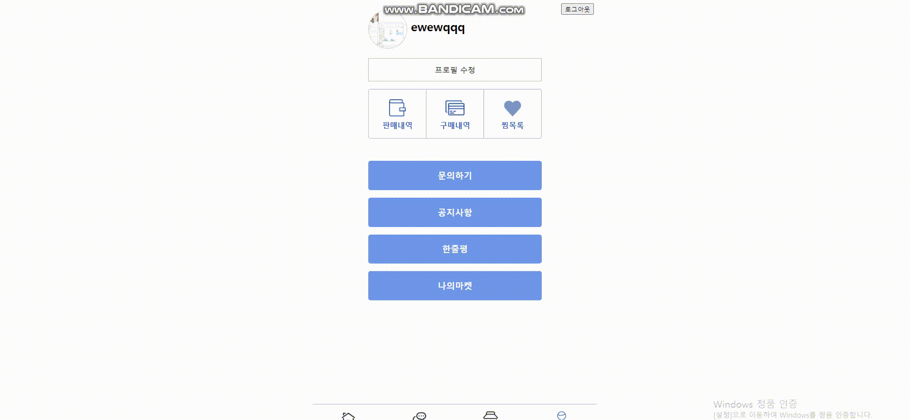 
JWT Token을 이용한 인증처리로, 멤버 마이페이지를 구현하였습니다. 
찜목록, 구매목록, 판매목록, 나의마켓, 공지사항을 볼 수 있습니다.

## 4. 프론트엔드
### 4.1 기술스택
- `React.js,redux,redux-saga,axios` 등
### 4.2 CSR (Client Side Rendering)
서버사이드렌더링 보다는 UX을 중시하여 SPA를 적용하였습니다. 
nginx를 이용하여 프론트 서버를 따로 두지 않았습니다. 
따로 검색엔진에 게시물이 노출되지 않아도 되기 때문에 어플리케이션내 검색 및 필터링을 이용하고, 
화면 깜빡임 없이 사용자가 어플리케이션을 이용할 수 있도록 개발하였습니다.

## 5. 백엔드

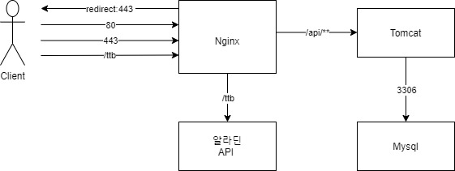 

---
### 5.1 기술 스택
- Programming Language : `java ` ver 11
- Framework : `springboot` ver 2.4.2
  - Embedded WAS : `tomcat`
- ORM
  - `JPA`
    - Hibernate
    - `Spring Data JPA`
  - `QueryDsl`
- `Spring security`
- Stomp (프론트 미구현)
- build tool : `gradle`

### 5.2 데이터베이스 ERD
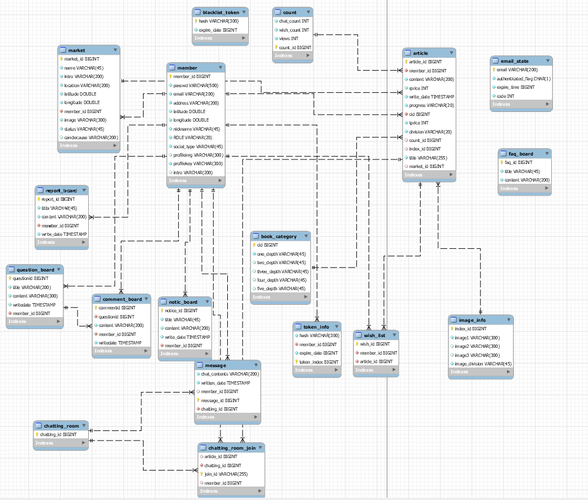 

### 5.3 ORM
- 도메인 내 엔티티클래스에 비즈니스 로직 적용.  
- querydsl 라이브러리를 이용한 동적쿼리 구성. 
  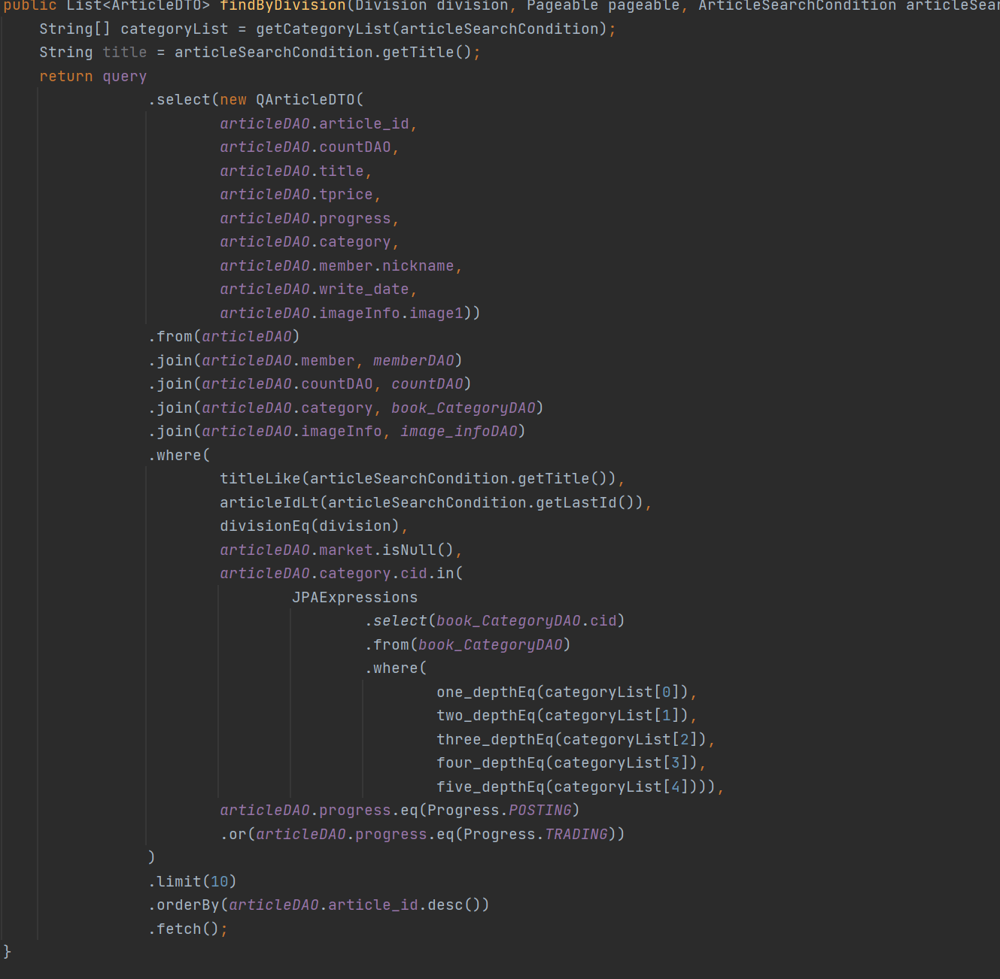 
  - 컴파일 단계에서 쿼리 오류 확인
  - `jpql`로 쿼리 구성시 쿼리 에러 확인 불가
- Spring Data JPA를 이용하여 Repository interface 사용하였으며, 간단한 CRUD 이용
- 복잡한 쿼리는 Repository <- CustomRepository <- RepositoryImpl 로 구성.

### 5.4 RestAPI
- 스프링 서버는 RESTful API 서버로써 구성.
- 모든 데이터는 json으로 통신.
## 6. 배포
- NCP(Naver Cloud Platform) 를 이용하여 클라우드 서버 구성
  - CentOS 기반의 micro server 사용.
  - volta (javascript manager) tool로 node,pm2 등 버전관리
  - proxy-server : nginx
  - RDB : Mysql ver 8.0.23
  - SSL : certbot  
- gradle build tool을 이용하여 의존성 관리
- gradle task scp를 이용하여 tcp 통신으로 jar파일 클라우드 서버 전송.
- 구글 드라이브로 gdown 패키지를 이용하여 클라우드 서버 리액트 빌드.tar 전송.

## 7. 사용 툴
`POSTMAN, Notion, Slack, Skype, KakaoTalk 등`
## 8. 프로젝트원
Web design : [김민주](https://github.com/kimmin47)

Frontend : [윤이찬미](https://github.com/cksal0805) , [박형규](https://github.com/hyeongkyuPark)

Backend : [이승우](https://github.com/xonic789) , [모세훈](https://github.com/ehaakdl)

